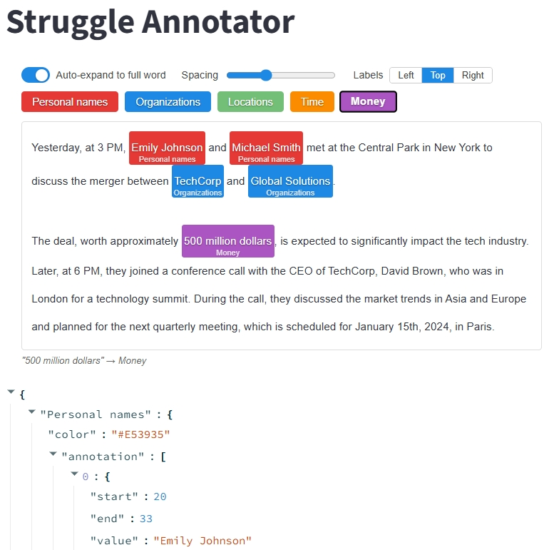

[](YOUR_APP_URL)
# [Struggle Annotator](https://struggle-annotator.streamlit.app/)

<a href="https://streamlit.io">
  <svg width="301" height="165" viewBox="0 0 301 165" fill="none" xmlns="http://www.w3.org/2000/svg" aria-label="Streamlit Logo">
    <path d="m150.731 101.547-52.592-27.8-91.292-48.25c-.084-.083-.25-.083-.334-.083-3.333-1.584-6.75 1.75-5.5 5.083L47.53 149.139l.008.025c.05.117.092.233.142.35 1.909 4.425 6.075 7.158 10.609 8.233.383.084.657.159 1.117.251.459.102 1.1.241 1.65.283.09.008.174.008.266.016h.067c.066.009.133.009.2.017h.091c.059.008.125.008.184.008h.108c.067.009.133.009.2.009a817.728 817.728 0 0 0 177.259 0c.708 0 1.4-.034 2.066-.1l.634-.075c.025-.009.058-.009.083-.017.142-.017.283-.042.425-.067.208-.025.417-.066.625-.108.417-.092.606-.158 1.172-.353.565-.194 1.504-.534 2.091-.817.588-.283.995-.555 1.487-.863a26.566 26.566 0 0 0 1.774-1.216c.253-.194.426-.318.609-.493l-.1-.058-99.566-52.617Z" fill="#FF4B4B"/>
    <path d="M294.766 25.498h-.083l-91.326 48.25 50.767 75.609 46.4-118.859v-.167c1.167-3.5-2.416-6.666-5.758-4.833" fill="#7D353B"/>
    <path d="M155.598 2.556c-2.334-3.409-7.417-3.409-9.667 0L98.139 73.748l52.592 27.8 99.667 52.674c.626-.613 1.128-1.21 1.658-1.841a20.98 20.98 0 0 0 2.067-3.025l-50.767-75.608-47.758-71.192Z" fill="#BD4043"/>
  </svg>
</a>

A Streamlit custom component for interactive text annotation, useful for NER-style labeling tasks. The Python wrapper is published as `struggle_annotator`; the frontend is built with TypeScript and React per the standard Streamlit Components pattern.



## Installation

```bash
pip install struggle-annotator
```

## Quick Start

```python
import streamlit as st
from struggle_annotator import txt_annotator

text = (
    "Yesterday, at 3 PM, Emily Johnson and Michael Smith met at the Central Park "
    "in New York to discuss the merger between TechCorp and Global Solutions.\n\n"
    "The deal, worth approximately 500 million dollars, is expected to "
    "significantly impact the tech industry. Later, at 6 PM, they joined a "
    "conference call with the CEO of TechCorp, David Brown, who was in London "
    "for a technology summit. During the call, they discussed the market trends "
    "in Asia and Europe and planned for the next quarterly meeting, which is "
    "scheduled for January 15th, 2024, in Paris."
)

label_dict = {
    "Personal names": {"color": "red"},
    "Organizations":  {"color": "blue"},
    "Locations":      {"color": "green"},
    "Time":           {"color": "orange"},
    "Money":          {"color": "purple"},
}

label_dict = txt_annotator(text, label_dict)
st.json(label_dict)
```

## UI Layout

The component renders two stacked regions:

1. **Top — Entity legend.** One button per entity, styled with that entity's color. Clicking a button makes it the *active* entity; the active button is visually emphasized (border + slight scale).
2. **Bottom — Annotatable document.** The full `text` is shown with any existing annotations highlighted in their entity's color. Below the text, a live status line shows the currently selected span and the active label.

## API

### Signature

```python
txt_annotator(text: str, label_dict: dict, key: str | None = None) -> dict
```

### Parameters

- **`text`** (`str`): The raw text to annotate. Treated as a Python string; offsets are measured in Python `str` indices (UTF-16-independent, code-point–based).
- **`label_dict`** (`dict[str, dict]`): Defines entities. Each key is the label name; each value must contain:
  - `color` (`str`, required): Any valid CSS color (`"red"`, `"#ff8800"`, `"rgb(0, 128, 255)"`).
  - `annotation` (`list[dict]`, optional): Pre-existing spans rendered on load. Each entry has the shape `{"start": int, "end": int, "value": str}`. If omitted, it is initialized to `[]`.
- **`key`** (`str`, optional): Standard Streamlit component key. Required if you render multiple annotators on the same page.

### Returns

The same `label_dict` shape, with every entity's `annotation` list reflecting the current state of the UI. The function returns on every interaction (Streamlit's standard component re-run model), so the latest annotations are always available after the call.

### Offsets

- Half-open interval `[start, end)`, matching Python slicing: `text[start:end] == value`.
- Indices are over the raw `text` string, including newlines and whitespace.

## Annotation Workflow

1. The user clicks an entity button in the legend. That entity becomes active.
2. The user selects a span of text with the mouse.
3. On `mouseup`, leading/trailing whitespace is trimmed from the selection. If the trimmed span is empty, the selection is ignored.
4. The trimmed span is highlighted in the active entity's color and appended to that entity's `annotation` list.
5. The status line below the text updates to show the selected text and label.
6. To remove an annotation, the user clicks an existing highlighted span (a single click with no drag). The highlight is removed and the corresponding entry is deleted from `label_dict`.

If text is selected while **no** entity is active, the selection is ignored and a hint is shown in the status line ("Select an entity first").

### Overlap Policy

New spans that overlap an existing annotation are **rejected** by default, and a brief warning is shown in the status line. This avoids ambiguous nested annotations in v1. (Allowing nesting or replacement is out of scope for the initial release; see *Non-goals* below.)

### Click vs. Drag

A click on a highlighted span is interpreted as "remove" only when the `mousedown` and `mouseup` positions are within the same span and no selection range was produced. Any drag that produces a non-empty selection is treated as a new annotation attempt, never as a remove.

## State Model

The component uses Streamlit's standard component value mechanism. Internally, the frontend keeps its own annotation state and sends the updated `label_dict` back to Python on every change. Streamlit re-runs the script with the new return value; no `st.session_state` plumbing is required from the caller.

If you want to persist annotations across page reloads or sessions, store the returned `label_dict` in `st.session_state` or write it to disk yourself.

## Data Examples

### Input

```python
label_dict = {
    "Personal names": {"color": "red"},
    "Organizations":  {"color": "blue"},
    "Locations":      {"color": "green"},
    "Time":           {"color": "orange"},
    "Money":          {"color": "purple"},
}
```

### Output (after annotation)

```python
{
    "Personal names": {
        "color": "red",
        "annotation": [
            {"start": 20,  "end": 33,  "value": "Emily Johnson"},
            {"start": 38,  "end": 51,  "value": "Michael Smith"},
            {"start": 327, "end": 338, "value": "David Brown"},
        ],
    },
    "Organizations": {
        "color": "blue",
        "annotation": [
            {"start": 118, "end": 126, "value": "TechCorp"},
            {"start": 131, "end": 147, "value": "Global Solutions"},
        ],
    },
    "Locations": {
        "color": "green",
        "annotation": [
            {"start": 63,  "end": 75,  "value": "Central Park"},
            {"start": 79,  "end": 87,  "value": "New York"},
            {"start": 351, "end": 357, "value": "London"},
            {"start": 436, "end": 440, "value": "Asia"},
            {"start": 445, "end": 451, "value": "Europe"},
            {"start": 542, "end": 547, "value": "Paris"},
        ],
    },
    "Time": {
        "color": "orange",
        "annotation": [
            {"start": 0,   "end": 9,   "value": "Yesterday"},
            {"start": 14,  "end": 18,  "value": "3 PM"},
            {"start": 265, "end": 269, "value": "6 PM"},
            {"start": 519, "end": 531, "value": "January 15th"},
            {"start": 533, "end": 537, "value": "2024"},
        ],
    },
    "Money": {
        "color": "purple",
        "annotation": [
            {"start": 179, "end": 198, "value": "500 million dollars"},
        ],
    },
}
```

Annotations within each entity are sorted by `start` ascending. Key order within each annotation is `start`, `end`, `value`.

## Non-goals (v1)

- Nested or overlapping annotations.
- Relation annotation between spans.
- Multi-document workflows or document navigation.
- Keyboard shortcuts (planned for a future release).
- Annotation history / undo-redo beyond the most recent action.

## Development

The frontend lives in `frontend/` (TypeScript + React, built with Vite). The Python wrapper in `struggle_annotator/__init__.py` declares the component via `streamlit.components.v1.declare_component` and re-exports `txt_annotator`.

```bash
# Frontend dev
cd frontend
npm install
npm run dev

# Python (editable install)
pip install -e .
```

Set `_RELEASE = False` in `struggle_annotator/__init__.py` during local development to point at the Vite dev server.

